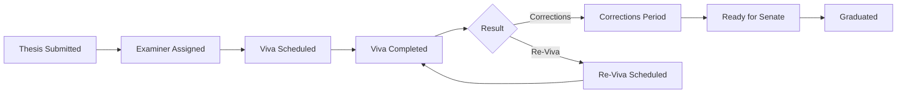
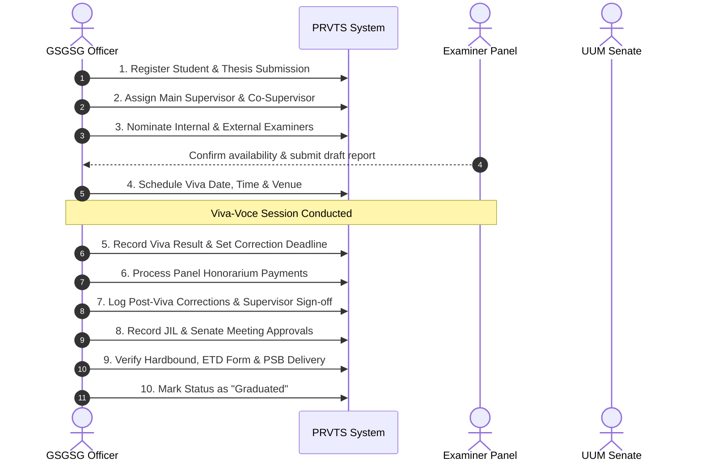

# PRVTS - Postgraduate Research & Viva Tracking System
# 📖 User Manual & Comprehensive System Handbook

**Ghazali Shafie Graduate School of Government (GSGSG)**  
**Universiti Utara Malaysia (UUM)**

---

## 📑 Table of Contents

1. [System Overview & Architecture](#1-system-overview--architecture)
2. [User Roles & Access Permissions](#2-user-roles--access-permissions)
3. [Authentication & Account Management](#3-authentication--account-management)
   - [Logging In](#31-logging-in)
   - [Mandatory First-Time Password Change](#32-mandatory-first-time-password-change)
   - [Forgot / Reset Password](#33-forgot--reset-password)
   - [Profile & Account Settings](#34-profile--account-settings)
4. [User Interface & System Navigation](#4-user-interface--system-navigation)
   - [Sidebar Navigation](#41-sidebar-navigation)
   - [Top Header & Quick Actions](#42-top-header--quick-actions)
   - [Flash Notifications & Feedback](#43-flash-notifications--feedback)
5. [Dashboard & Operational Analytics](#5-dashboard--operational-analytics)
   - [KPI Summary Cards](#51-kpi-summary-cards)
   - [Interactive Visualizations & Charts](#52-interactive-visualizations--charts)
   - [Color-Coded Priority Alert System](#53-color-coded-priority-alert-system)
   - [Academic Staff Pending Response Tracker](#54-academic-staff-pending-response-tracker)
   - [One-Click Alert Resolution](#55-one-click-alert-resolution)
6. [Student Records Management](#6-student-records-management)
   - [Student Directory & Live Search](#61-student-directory--live-search)
   - [Registering a New Student (5-Stage Form)](#62-registering-a-new-student-5-stage-form)
   - [Viewing Student Profile & History](#63-viewing-student-profile--history)
   - [Editing Student Records](#64-editing-student-records)
   - [Remarks & File Attachments Timeline](#65-remarks--file-attachments-timeline)
   - [Single & Bulk Student Deletion](#66-single--bulk-student-deletion)
7. [Academic Staff Registry](#7-academic-staff-registry)
   - [Supervisors Management](#71-supervisors-management)
   - [Examiners Management (Internal vs External)](#72-examiners-management-internal-vs-external)
   - [Chairpersons Management](#73-chairpersons-management)
   - [Quick-Add Staff Modal in Student Forms](#74-quick-add-staff-modal-in-student-forms)
8. [Data Import & Export Facilities](#8-data-import--export-facilities)
   - [Excel / CSV Bulk Student Import](#81-excel--csv-bulk-student-import)
   - [Advanced Filter Panel for Reports](#82-advanced-filter-panel-for-reports)
   - [Executive Excel Export (.xlsx)](#83-executive-excel-export-xlsx)
   - [Formal PDF Report Export (.pdf)](#84-formal-pdf-report-export-pdf)
   - [Single Student Summary Export](#85-single-student-summary-export)
   - [Thesis Certification Word Template (.docx)](#86-thesis-certification-word-template-docx)
9. [User Administration & Security](#9-user-administration--security)
   - [Creating & Managing Users](#91-creating--managing-users)
   - [Role Assignment & Elevation](#92-role-assignment--elevation)
   - [Admin Password Overrides](#93-admin-password-overrides)
10. [End-to-End Postgraduate Workflow Guide](#10-end-to-end-postgraduate-workflow-guide)
11. [Troubleshooting & Frequently Asked Questions (FAQ)](#11-troubleshooting--frequently-asked-questions-faq)

---

## 1. System Overview & Architecture

The **Progress Report Viva Tracking System (PRVTS)** is a dedicated enterprise web application built for the **Ghazali Shafie Graduate School of Government (GSGSG)** at **Universiti Utara Malaysia (UUM)**. 

### Key Purpose
To digitize, track, and optimize the postgraduate research lifecycle for Masters, PhD, and DBA candidates across all stages:
- Proposal and draft thesis submission.
- Examination panel appointment and confirmation.
- Viva-voce scheduling and execution.
- Post-viva correction periods and examiner endorsements.
- JIL (Jawatankuasa Ijazah Lanjutan) and University Senate approvals.
- Final hardbound copies, ETD submissions, and graduation clearance.



### Technical Stack Summary
- **Backend Architecture**: PHP 8+ MVC (Model-View-Controller) architecture.
- **Database**: MySQL 8.0+ with indexed relational foreign keys and cascading integrity.
- **Frontend**: Responsive HTML5, Vanilla CSS3 design system, and Bootstrap 5 with Bootstrap Icons.
- **Visual Analytics**: Chart.js for real-time statistical distributions.
- **Document Engines**:
  - `dompdf/dompdf` for high-resolution vector PDF generation.
  - `phpoffice/phpspreadsheet` for styled executive Excel reports.

---

## 2. User Roles & Access Permissions

The system operates with a dual-role access control model enforced via server-side middleware:

| Feature / Module | Administrator (`admin`) | Academic Staff (`staff`) |
| :--- | :---: | :---: |
| **Operational Dashboard & Visual Analytics** | Full Access | No Access |
| **Advanced Search & Student Directory** | Full Access | Full Access |
| **View Student Profile & Timelines** | Full Access | Full Access |
| **Add New Student** | Full Access | No Access |
| **Edit / Update Student Records** | Full Access | No Access |
| **Delete Student (Single / Bulk)** | Full Access | No Access |
| **Post Remarks & Upload Attachments** | Full Access | Full Access |
| **Academic Staff Registry (Supervisors/Examiners)** | Full Access | No Access |
| **Bulk Import (Excel/CSV)** | Full Access | No Access |
| **Generate Bulk Reports (PDF & Excel)** | Full Access | Full Access |
| **Generate Single Student Reports** | Full Access | Full Access |
| **Generate Docx Thesis Certification** | Full Access | Full Access |
| **User Administration & Password Resets** | Full Access | No Access |
| **Manage Own Profile & Password** | Full Access | Full Access |

---

## 3. Authentication & Account Management

### 3.1 Logging In
1. Open your web browser and navigate to the PRVTS portal URL (e.g. `http://localhost/PRV_Tracking_System/login` or your institutional domain).
2. Enter your registered **Username** or **Email Address**.
3. Enter your **Password**.
4. Click **Sign In**.

### 3.2 Mandatory First-Time Password Change
For security compliance, default or administrative-created accounts require a password reset upon initial login:
1. Upon your first login, the system redirects you automatically to the **First Login Password Setup** screen.
2. Enter your new secure password (minimum 6 characters, mixed case and numbers recommended).
3. Confirm your new password.
4. Click **Update Password** to activate full account access.

### 3.3 Forgot / Reset Password
1. On the login screen, click **Forgot Password?**.
2. Contact your GSGSG System Administrator to initiate a temporary password reset.
3. Once the administrator resets your password, log in with the temporary credentials; you will immediately be prompted to define your new private password.

### 3.4 Profile & Account Settings
Navigate to **My Profile** from the sidebar or top navigation menu:
- **Update Full Name & Email**: Modify your display name and contact email.
- **Change Password**: Provide your current password, type the new password, confirm it, and click **Save Changes**.

---

## 4. User Interface & System Navigation

### 4.1 Sidebar Navigation
The collapsible left sidebar provides categorized navigation based on your role:

- **Main**:
  - `Dashboard`: Real-time metrics, status breakdowns, and action alerts *(Admin only)*.
  - `Analytics`: Advanced cohort trends and demographic analysis *(Admin only)*.
- **Students**:
  - `Search Students`: Quick search and filtered directory table.
  - `Add Student`: Comprehensive multi-stage student registration form *(Admin only)*.
  - `Manage Students`: Grid overview with edit, delete, and bulk action triggers *(Admin only)*.
- **Data**:
  - `Import Excel`: Batch upload student records via spreadsheet *(Admin only)*.
  - `Generate Report`: Export filtered lists to PDF and Executive Excel.
  - `Thesis Certification`: Export official pre-filled Word templates.
- **Administration** *(Admin only)*:
  - `Manage Users`: System access, role switching, and security settings.
  - `Academic Staff`: Supervisor, Examiner, and Chairperson registries.
- **Account**:
  - `My Profile`: User account details and password configuration.
  - `Logout`: Securely end the active session.

### 4.2 Top Header & Quick Actions
- **Toggle Sidebar**: Click the hamburger icon (`☰`) to expand or collapse the sidebar for wide screens.
- **Global Search Bar**: Quickly look up students by Matric Number, Name, or Thesis Title from any page.
- **User Avatar & Status Badge**: Displays currently logged-in user name and role badge (`ADMIN` or `STAFF`).

### 4.3 Flash Notifications & Feedback
All system actions (creates, updates, deletes, imports) trigger dismissible, color-coded toast alerts in the top-right corner:
- 🟢 **Success**: Action completed successfully.
- 🔴 **Danger / Error**: Validation failure or system exception.
- 🟡 **Warning**: Attention required (e.g. duplicate record warning).
- 🔵 **Info**: General procedural notice.

---

## 5. Dashboard & Operational Analytics

*(Accessible by Administrators)*

```
+-------------------------------------------------------------------------------+
| PRVTS OPERATIONS DASHBOARD                                                    |
+-------------------+-------------------+-------------------+-------------------+
|  TOTAL STUDENTS   |  VIVA SCHEDULED   | CORRECTIONS DUE   |     GRADUATED     |
|       142         |        18         |        24         |        65         |
+-------------------+-------------------+-------------------+-------------------+
| [ School Chart ]  |  [ Degree Chart ] | [ Priority Alerts & Action Center ]   |
|                   |                   | 🔴 5 Overdue Corrections (>90d)       |
|                   |                   | 🟡 3 Corrections Due Soon (<14d)      |
|                   |                   | 🔵 2 Upcoming Viva Sessions           |
|                   |                   | 🟢 4 Pending Honorarium Payments      |
+-------------------+-------------------+---------------------------------------+
```

### 5.1 KPI Summary Cards
Located at the top of the dashboard for instant executive visibility:
1. **Total Students**: Total active and historical postgraduate candidates registered in PRVTS.
2. **Viva Scheduled**: Candidates with confirmed upcoming viva examination dates.
3. **Pending Corrections**: Candidates currently in post-viva correction period.
4. **Graduated**: Candidates who have successfully completed all requirements and senate clearance.

### 5.2 Interactive Visualizations & Charts
- **Distribution by School**: Visual breakdown of candidates across GSGSG, SOG, SOL, etc.
- **Distribution by Degree Level**: Ratio of Masters, PhD, and DBA candidates.
- **Research Status Funnel**: Candidates categorized by lifecycle stages from submission to graduation.

### 5.3 Color-Coded Priority Alert System
PRVTS automatically computes real-time urgency thresholds:

| Alert Type | Color Code | Condition / Trigger | Required Action |
| :--- | :---: | :--- | :--- |
| **Upcoming Viva Sessions** | 🔵 **Blue** | Viva examination date is within the next **14 days**. | Finalize room/online setup, dispatch panel files. |
| **Pending Honorarium** | 🟢 **Green** | Viva completed, but Chairperson or Examiner honorarium marked unpaid. | Process payment vouchers to academic panel. |
| **Corrections Due Soon** | 🟡 **Yellow** | Post-viva correction deadline is within the next **14 days**. | Send reminder notice to candidate and supervisor. |
| **Overdue Corrections** | 🔴 **Red** | Correction deadline has passed without submission. | Issue formal warning or extension evaluation. |

### 5.4 Academic Staff Pending Response Tracker
Highlights external and internal examiners who have not yet submitted reports or confirmed viva availability:
- Shows Candidate Name, Staff Name, Role (Internal/External), and Days Elapsed.
- Includes direct clickable **`tel:`** phone links and **`mailto:`** email links for instant follow-up.

### 5.5 One-Click Alert Resolution
- Each alert card includes a **Resolve (Checkmark)** button.
- Clicking Resolve hides the item from the active action queue and logs the resolution in the database without altering core student records.

---

## 6. Student Records Management

### 6.1 Student Directory & Live Search
1. Navigate to **Search Students** or **Manage Students**.
2. Type in the search box: live search queries across **Matric No**, **Student Name**, **Thesis Title**, **Programme**, and **School**.
3. Use dropdown filters to narrow down by **Degree Level** (Masters, PhD, DBA) or **Research Status**.
4. Click any student row to view their complete dossier.

### 6.2 Registering a New Student (5-Stage Form)
Navigate to **Add Student** (`/students/create`). The form is structured into five cohesive sections:

#### Section 1: Basic Information
- **Matric Number**: Unique identifier (e.g. `901234`).
- **Full Name**: Candidate's formal full name.
- **Degree Level**: Select *Masters*, *PhD*, *DBA*, or choose *Other* to input a custom programme.
- **School / Department**: Select academic school (e.g. *GSGSG*, *SOG*, *TISSA*).
- **Cohort**: Intake semester/year (e.g. *A231*, *A241*).
- **ITS Receipt Date**: Date thesis was formally received by the Graduate School.
- **Thesis Title**: Full registered research title.
- **Current Research Status**: Initial status (default: *Thesis Submitted*).

#### Section 2: Supervision Panel
- **Main Supervisor**: Select from registered academic supervisors. *(Click "+ Quick Add" if supervisor is not yet in directory)*.
- **Co-Supervisor(s)**: Optionally link co-supervisors.

#### Section 3: Viva Arrangement & Examiner Panel
- **Internal Examiner**: Select from internal examiner registry.
- **External Examiner**: Select from external examiner registry (with institution name).
- **Chairperson**: Select or enter session chairperson.
- **Draft Copy Submission Dates**: Record hard copy and soft copy submission dates.
- **Turnitin Similarity Percentage**: Similarity index % at submission.
- **Viva Date & Venue**: Set the official viva-voce examination timestamp.
- **Viva Result**: Post-viva outcome (*Minor Corrections*, *Major Corrections*, *Re-Viva*, *Passed*, etc.).
- **Honorarium Status**: Record payment status for Chairperson, Internal Examiner, External Examiner, and Refreshments.

#### Section 4: Post-Viva Corrections
- **Correction Deadline**: Computed date based on assigned correction period (e.g. 3 months, 6 months).
- **Correction Submission Date**: Date student submits revised thesis and matrix table.
- **Supervisor Endorsement Date**: Date supervisor signs off on corrections.
- **Examiner Verification**: Internal and External examiner report verification status (*Pending*, *Verified*, *Rejected*).
- **JIL Meeting Details**: Meeting date and paper reference number.

#### Section 5: Senate & Graduation Clearance
- **Senate Meeting Details**: Senate meeting date and approval number.
- **GAIS Key-in Date**: Date record was entered into the Graduate Academic Information System.
- **Final Submissions**: Check dates for *Hardbound Copies*, *Loose Copies*, *CD Copies*, and *ETD Submission Form*.
- **Sent to PSB Date**: Date final hardbound copies were delivered to the Sultanah Bahiyah Library (PSB).
- **Graduation Status**: *Not Ready*, *Ready for Senate*, or *Graduated*.

---

### 6.3 Viewing Student Profile & History
Navigate to `/student/{id}` to access the comprehensive student dossier:
- **Header Badge**: Displays current status, degree level, and matric number.
- **Detail Tabs**:
  1. `Overview`: Academic information, supervisor panel, thesis title.
  2. `Viva Details`: Examination dates, panel members, Turnitin %, and honorarium status.
  3. `Corrections & Approvals`: Correction timelines, examiner endorsements, JIL/Senate milestones.
  4. `Remarks & Documents`: Chronological log of officer notes and uploaded files.
- **Quick Action Bar**:
  - `Export PDF`: Download single-student executive dossier.
  - `Export Excel`: Download single-student structured spreadsheet.
  - `Edit Record`: Open full editing interface.

---

### 6.4 Editing Student Records
1. From the student profile or management table, click **Edit Student** (`/students/edit/{id}`).
2. Update any relevant fields across the 5 sections.
3. Click **Save Changes** at the bottom of the page. All changes are versioned and updated immediately.

---

### 6.5 Remarks & File Attachments Timeline
Keep an auditable, timestamped trail of student progress, issues, meeting minutes, and document receipts:

```
+-------------------------------------------------------------------------------+
| 💬 POST A REMARK                                                              |
| [ Write note / update here...                                               ] |
| 📎 Attach File: [ Choose File ] (Max 10MB: PDF, DOCX, XLSX, JPG, PNG, ZIP)   |
| [ Post Remark Button ]                                                        |
+-------------------------------------------------------------------------------+
| TIMELINE HISTORY                                                              |
| ----------------------------------------------------------------------------- |
| 👤 Officer Sarah | 📅 18 Aug 2026 10:15 AM                                    |
| "Received revised Chapter 4 and 5 with supervisor endorsement signature."    |
| 📎 [ Download: Revised_Ch4_Ch5.pdf (2.4 MB) ]  [ Inline Preview ]             |
+-------------------------------------------------------------------------------+
```

- **Supported Attachment Formats**: `.pdf`, `.doc`, `.docx`, `.xls`, `.xlsx`, `.jpg`, `.jpeg`, `.png`, `.zip`.
- **Max File Size**: Up to 10 MB per attachment.
- **Inline Previews**: PDF and image files can be previewed directly in the browser modal without downloading.

---

### 6.6 Single & Bulk Student Deletion
*(Admin Only)*

- **Single Record Deletion**:
  1. Open student profile or locate student in **Manage Students**.
  2. Click the **Delete (Trash)** icon.
  3. Confirm the security prompt. *Note: Cascading deletion removes linked viva records, corrections, remarks, and attached files.*
- **Bulk Record Deletion**:
  1. Navigate to **Manage Students** (`/students/manage`).
  2. Select candidate checkboxes individually or click **Select All**.
  3. Click the red **Delete Selected** button at the top of the table.
  4. Review the count of selected records in the confirmation modal and click **Confirm Bulk Delete**.

---

## 7. Academic Staff Registry

*(Admin Only)*

Manage the institutional database of supervisors, examiners, and session chairpersons via **Academic Staff** (`/staff`).

### 7.1 Supervisors Management
- **Add Supervisor**: Enter Name, Department/School, Phone Number, and Email Address.
- **Edit / Update**: Modify contact info or academic department.
- **Direct Communication**: Click the telephone icon (`tel:`) to call or the envelope icon (`mailto:`) to email.

### 7.2 Examiners Management (Internal vs External)
- **Classification**: Tag examiner as **Internal** (UUM faculty) or **External** (External University / Organization).
- **Institution**: Record external institution (e.g. *Universiti Malaya*, *Universiti Kebangsaan Malaysia*).
- **Contact Channels**: Phone and email records used by the Dashboard pending tracker.

### 7.3 Chairpersons Management
- Maintain registry of appointed viva session chairpersons for quick dropdown selection.

### 7.4 Quick-Add Staff Modal in Student Forms
When creating or editing a student record, you do not need to leave the page if a staff member is not in the list:
1. Click the **+ Quick Add** button next to the Supervisor, Examiner, or Chairperson dropdown.
2. Enter the staff member's name, email, phone, and institution in the popup modal.
3. Click **Save Staff**.
4. The modal closes and the newly registered staff member is automatically selected in your active form.

---

## 8. Data Import & Export Facilities

### 8.1 Excel / CSV Bulk Student Import
*(Admin Only)*

Quickly onboard existing cohorts or semester batches via spreadsheet:
1. Navigate to **Import Excel** (`/import`).
2. Click **Download Import Template** to retrieve the standardized Excel format.
3. Prepare your data ensuring the mandatory columns are populated:
   - `Matric No` *(Unique)*
   - `Student Name`
   - `Degree Level` *(Masters, PhD, DBA)*
   - `School`
   - `Thesis Title`
   - `Status`
4. Click **Choose File**, select your `.xlsx` or `.csv` file, and click **Upload & Import**.
5. The system parses each row, reports successful rows, and flags any invalid or duplicate matric numbers.

---

### 8.2 Advanced Filter Panel for Reports
Navigate to **Generate Report** (`/export`). Filter records before generating PDF or Excel exports:

```
+-------------------------------------------------------------------------------+
| 🔍 ADVANCED REPORT FILTER PANEL                                               |
+-------------------+-------------------+-------------------+-------------------+
| VIVA MONTH        | VIVA YEAR         | SCHOOL            | DEGREE LEVEL      |
| [ All Months    ] | [ 2026          ] | [ GSGSG         ] | [ PhD           ] |
+-------------------+-------------------+-------------------+-------------------+
| RESEARCH STATUS   | SORT BY                                                   |
| [ Viva Completed] | [ Viva Date (Earliest First)                            ] |
+-------------------+-----------------------------------------------------------+
| [ Apply Filter ]       [ Reset Filters ]       [ 📄 Export PDF ]   [ 📊 Export Excel ]
+-------------------------------------------------------------------------------+
```

- **Filter Criteria**:
  - **Viva Month**: Filter by month of examination (January to December).
  - **Viva Year**: Filter by specific year (e.g. 2024, 2025, 2026).
  - **School / Department**: Filter by academic unit (GSGSG, SOG, SOC, etc.).
  - **Degree Level**: Filter by Masters, PhD, or DBA.
  - **Research Status**: Filter by specific lifecycle stage.
- **Sort Ordering**:
  - Viva Date: Earliest First
  - Viva Date: Latest First
  - Month Sequence: (Jan to Dec)

---

### 8.3 Executive Excel Export (.xlsx)
Generates high-quality spreadsheets using `PhpSpreadsheet`:
- **Executive Styling**: Dark navy header banners (`#0F172A`) with official university typography.
- **Summary Metrics**: Embedded KPI cards summarizing Total Candidates, Degree breakdown, and Status counts above the main data table.
- **Optimized Layout**: Auto-fitted column widths, zebra-striped data rows, and structured border grids.

### 8.4 Formal PDF Report Export (.pdf)
Generates formatted, print-ready PDF documents using `Dompdf`:
- Includes official UUM GSGSG header logo and title.
- Shows applied filter criteria in document header.
- Clean landscape tabular layout with auto-pagination and page numbers.

### 8.5 Single Student Summary Export
On any student profile page (`/student/{id}`):
- Click **Export PDF** to generate an individual 1–2 page candidate dossier for committee meetings.
- Click **Export Excel** to generate a single-candidate data sheet.

### 8.6 Thesis Certification Word Template (.docx)
Navigate to **Thesis Certification** (`/docx-templates`):
1. Select the student from the searchable selector.
2. Click **Generate Certification Document**.
3. The system merges the student's matric number, name, thesis title, supervisor, and viva completion date directly into the official institutional `.docx` template and initiates an instant download.

---

## 9. User Administration & Security

*(Admin Only)*

Access via **Manage Users** (`/users`):

### 9.1 Creating & Managing Users
1. Click **Add New User**.
2. Enter **Full Name**, **Username**, **Email Address**, **Initial Password**, and **Role** (`Staff` or `Admin`).
3. Click **Create User**.

### 9.2 Role Assignment & Elevation
- Admins can change user roles from `Staff` to `Admin` or vice versa directly from the user management table.
- Role changes take effect immediately on the user's next request.

### 9.3 Admin Password Overrides
If a staff member forgets their credentials:
1. Locate the user in **Manage Users**.
2. Click **Reset Password**.
3. Provide a temporary password and enable **Force Password Change on Next Login**.
4. The user will be required to define their private credentials upon signing in.

---

## 10. End-to-End Postgraduate Workflow Guide

Follow this standard procedure for managing a candidate from start to finish:



1. **Thesis Submission**:
   - Register the candidate under **Add Student**.
   - Attach the receipt of ITS submission in **Remarks**.
   - Status: `Thesis Submitted`.
2. **Panel Appointment**:
   - Link Internal and External Examiners.
   - Record panel appointment letter dates.
   - Status: `Examiner Assigned`.
3. **Viva Scheduling**:
   - Enter confirmed Viva Date, Time, Venue, and Chairperson.
   - Record invitation letter dates.
   - Status: `Viva Scheduled`.
4. **Viva Examination**:
   - Record official Viva Outcome (e.g. Minor / Major Corrections).
   - Set the Correction Deadline (e.g. 3 months / 6 months from viva date).
   - Status: `Viva Completed` or `Re-Viva`.
5. **Honorarium Clearance**:
   - Mark honorarium payments as *Paid* for Chairperson and Examiners.
6. **Correction Verification**:
   - Upload revised thesis and matrix in **Remarks**.
   - Enter Supervisor Endorsement and Examiner Verification dates.
   - Status: `Corrections Submitted`.
7. **JIL & Senate Approval**:
   - Enter JIL and Senate meeting dates and minute numbers.
   - Status: `Ready for Senate`.
8. **Final Clearance & Graduation**:
   - Check off Hardbound copies, Loose copy, CD, and ETD form.
   - Record date delivered to Sultanah Bahiyah Library (PSB).
   - Change Status to `Graduated`.

---

## 11. Troubleshooting & Frequently Asked Questions (FAQ)

#### Q1: Why can't a staff member see the Dashboard or Analytics?
**A**: By design, the Operational Dashboard and Analytics modules are restricted to users with the `Admin` role. Staff users have access to Student Search, Profile Dossiers, Remarks, Export Reports, and Docx Templates.

#### Q2: What happens if an examiner is not in the dropdown list?
**A**: When creating or editing a student, click the **+ Quick Add** button next to the examiner field. Enter the examiner's name, email, phone, and institution to immediately register and select them.

#### Q3: Why is a student appearing in the Red Overdue Alert on the dashboard?
**A**: The student has completed their viva with corrections required, but the current date has exceeded the `correction_deadline` without a `correction_submission_date` recorded.

#### Q4: How do I export an Excel report for only PhD candidates who had viva in 2026?
**A**: Navigate to **Generate Report** (`/export`), set **Viva Year** to `2026`, set **Degree Level** to `PhD`, and click **Export Excel**.

#### Q5: What is the maximum file size for attachments in Remarks?
**A**: The maximum supported file size is **10 MB per file**. Ensure uploaded files are in approved formats (`.pdf`, `.docx`, `.xlsx`, `.jpg`, `.png`, `.zip`).

#### Q6: How do I backup or export the database?
**A**: Database administrators can export the complete `prvts_db` schema and data via phpMyAdmin or MySQL CLI (`mysqldump -u root -p prvts_db > backup.sql`).

---

*PRVTS - Ghazali Shafie Graduate School of Government (GSGSG), Universiti Utara Malaysia.*
