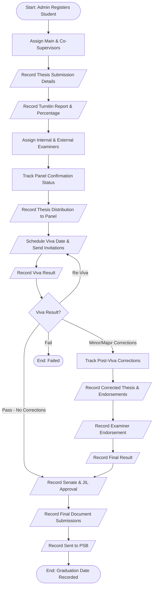
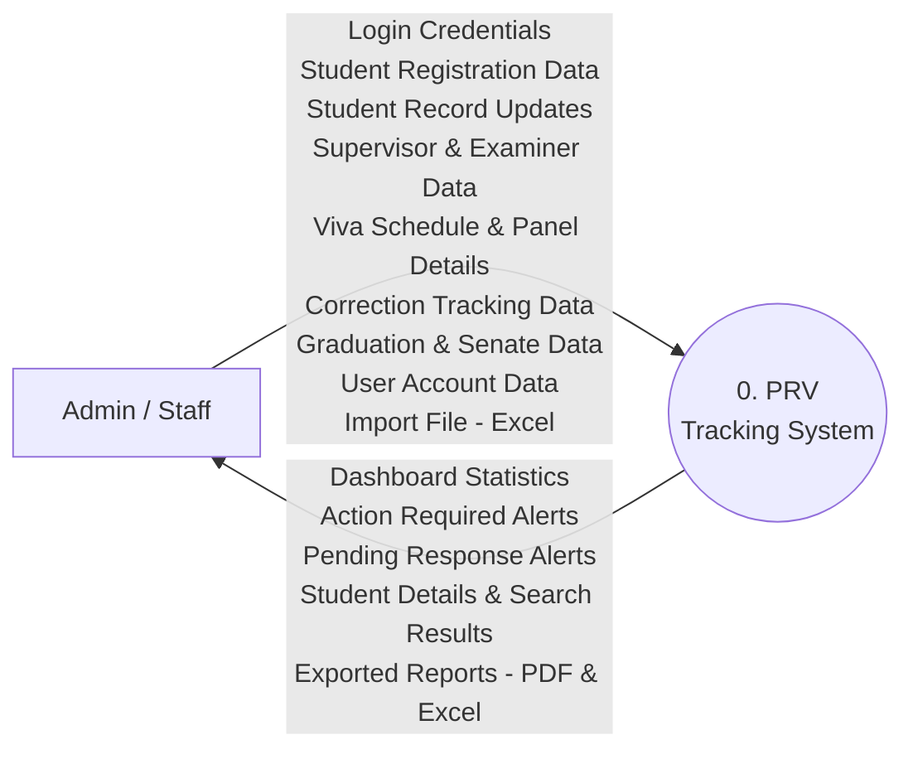
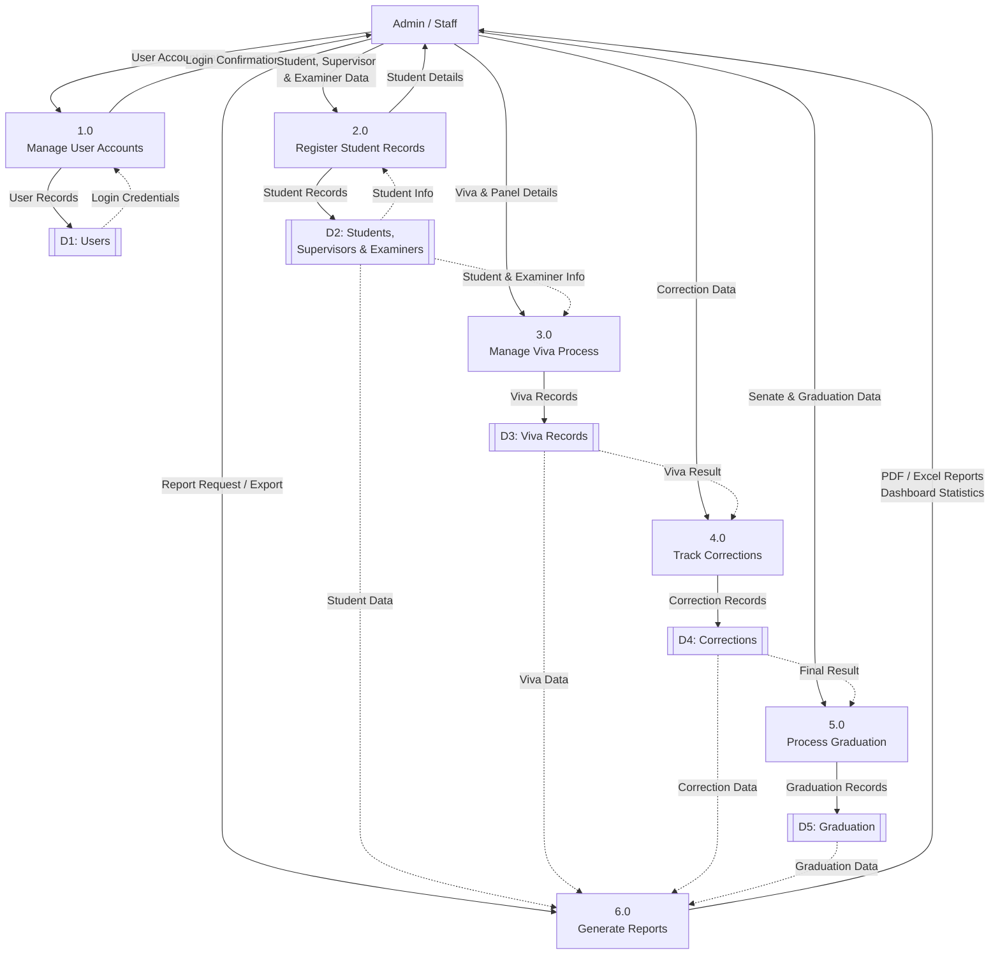
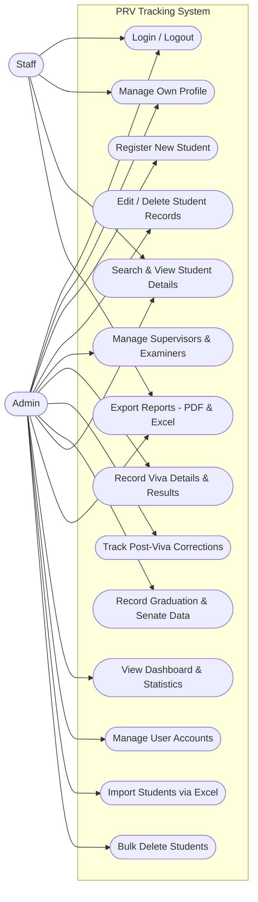

# PRV Tracking System - System Diagrams

Here are the diagrams for your report. They are written using **Mermaid** syntax, which you can easily copy and paste into tools like [Mermaid Live Editor](https://mermaid.live/), Notion, GitHub, or use as a reference to recreate them in Draw.io / Visio.

> [!IMPORTANT]
> All diagrams reflect the actual codebase. Only **Admin** and **Staff** users can access the system. Students, Supervisors, and Examiners are data records managed by Admin/Staff — they do not interact with the system directly.

---

## 1. System Flowchart (Core Process)
This flowchart shows the step-by-step lifecycle of how Admin/Staff tracks a student's Postgraduate Research & Viva journey in the system.

---

## 2. Context Diagram (Diagram 0)
The Context Diagram gives a high-level view of the entire PRV Tracking System. Since only Admin/Staff access the system, there is a single external entity.

---

## 3. Level 1 Data Flow Diagram (DFD)
The Level 1 DFD breaks down the Context Diagram into the primary sub-processes and shows how data moves between processes and data stores. All processes are performed by Admin/Staff.

*(Note: In standard DFD notation, circles represent processes, open rectangles/cylinders represent data stores, and squares represent external entities. Dashed lines represent read operations.)*

---

## 4. Use Case Diagram
This diagram shows the system's functionalities from the perspective of the two actors: Admin and Staff. Admin has full access, while Staff has read-only access to student records and reports.

---

### Tips for your report:
- **Flowchart**: Useful for explaining the logical sequence of events in the student tracking lifecycle.
- **Diagram 0 (Context)**: Put this in the introduction of your system architecture section to show the system's boundaries. Only Admin/Staff interact with the system directly.
- **DFD Level 1**: Use this to show how data is routed and stored across the 7 database tables (`users`, `students`, `supervisors`, `examiners`, `viva_records`, `corrections`, `graduation`).
- **Use Case**: Best used in the requirements gathering section to show what features were built for Admin vs Staff roles.
